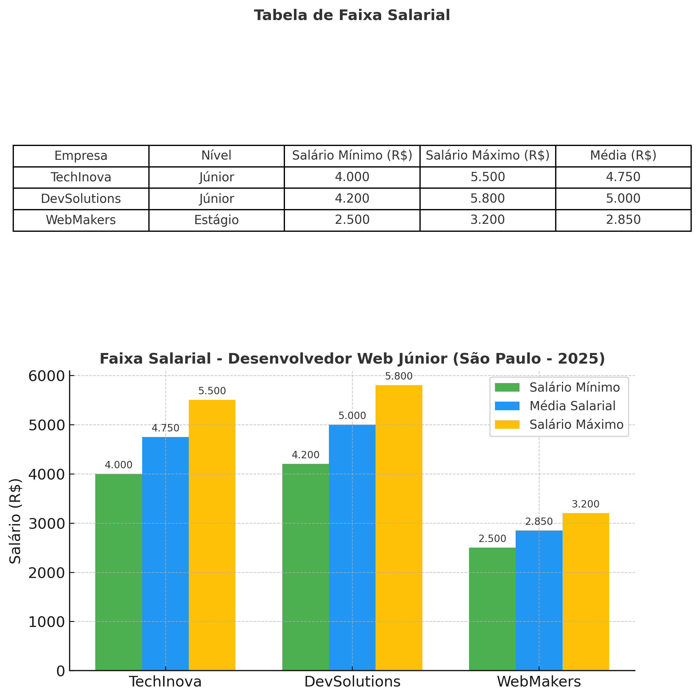

# ExperienciaPratica-II
Análise do perfil do Desenvolvedor Web Júnior em 2025. Relatório em PDF com hard e soft skills mais exigidas, faixas salariais e plano de ação profissional, incluindo gráficos e tabelas.

# 📊 Relatório – Perfil do Desenvolvedor Web Júnior em 2025

Este repositório contém a análise de 10 vagas de Desenvolvedor Web Júnior em São Paulo (2025), destacando as **hard skills**, **soft skills**, faixas salariais e um plano de ação para desenvolvimento profissional.

## 🔎 Conteúdo
- Principais **Hard Skills**: React.js, Node.js, SQL, Cloud (AWS/Azure).  
- Principais **Soft Skills**: Comunicação, Trabalho em equipe, Proatividade.  
- **Faixa salarial estimada**: R$ 4.000 a R$ 5.800 (média R$ 5.000).  
- **Plano de ação (6 meses)**: Aprimorar React.js, consolidar Node.js e melhorar comunicação.

## 📄 Relatório Completo
👉 [Baixar Relatório em PDF](./Relatorio_Desenvolvedor_Web_Junior.pdf)

## 📊 Gráfico e Tabela de Salários

## 🚀 Tecnologias Utilizadas
- Pesquisa em **LinkedIn, Glassdoor, Programathor e Indeed**
- Relatório elaborado em **PDF**
- Visualização com **gráficos e tabelas**

---

### 🔖 Hashtags
#DesenvolvimentoWeb #MercadoDeTI #CarreiraEmTecnologia #HardSkills #SoftSkills #AnaliseDeDados
